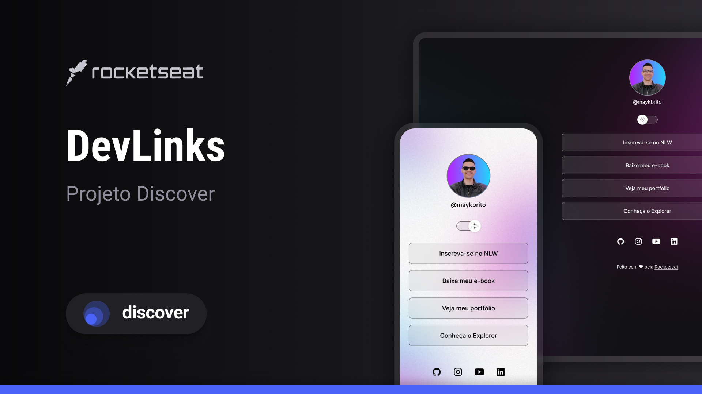

<h1 align="center">DevLinks</h1>

Programa exclusivo e gratuito, promovido pela Rocketseat para ensino de tecnologias WEB.

  <a href="#🚀-tecnologias">Tecnologias</a> •
  <a href="#💻-projeto">Projeto</a> •
  <a href="#📄-layout">Layout</a> •
  <a href="#📝-licença">Licença</a>

  

  

## 🚀 Tecnologias

Esse projeto foi desenvolvido com as seguintes tecnologias:

- HTML e CSS
- JavaScript
- Git e Github
- Figma

## 💻 Projeto

O DevLinks é um agregador de links para usar como cartão de visitas online.

## 📄 Layout

Você pode visualizar o layout do projeto através [DESSE LINK](https://www.figma.com/design/3EIHYk6UIcHLwXipGT9ac6/DevLinks-%E2%80%A2-Projeto-Discover--Community-?node-id=0-1&p=f&t=alfXmllEt0Is6GIB-0).  
É necessário ter conta no [FIGMA](https://figma.com) para acessá-lo.

## 📝 Licença

Esse projeto está sob a licença MIT.

Feito com ❤️ by Rocketseat 👋 [Participe da nossa comunidade!](https://discord.gg/rocketseat)
